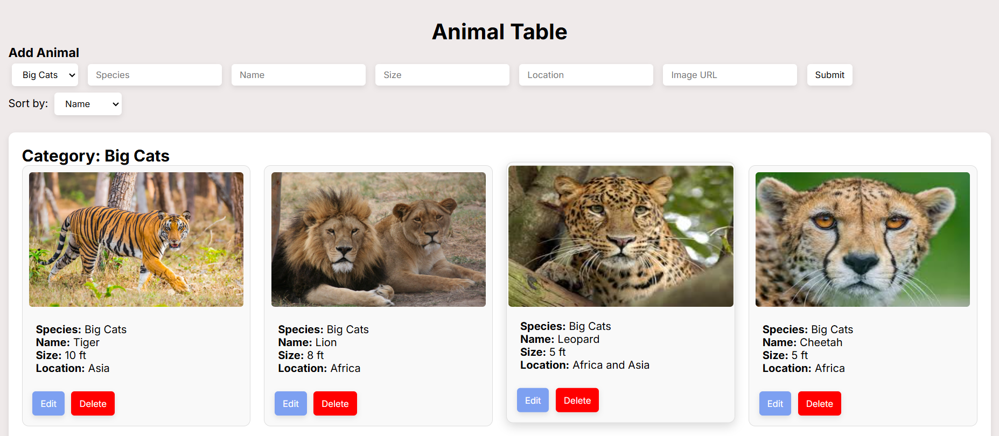

# Animal Tables 
The Animal Tables web application is a user-friendly platform that enables you to manage animal records effortlessly. With this tool, you can add new animals, edit existing entries, delete records, and sort the list by name, size, or location. Built with HTML, CSS, and JavaScript, the application offers an interactive experience for efficient animal data management.

## Features 
 Add & Edit Animals – Users can add new animals and edit as well.
 Delete Animals – Delete animals.
 Sort Animals – Sort by name, size, and location.
 Image show .
 Fully Responsive .

## Technologies Used 🛠
HTML, CSS, JAVA Script

## Installation
1. Clone the Repository
git clone https://github.com/ShivamGurjar07/IITB_assingment

## Folder Structure 
📁 animal-tables
├── 📄 index.html     # Main HTML file
├── 📄 styles.css     # Stylesheet
├── 📄 script.js      # JavaScript functionality
└── 📄 README.md      # Project documentation

## Screenshots 📸
🔹 image 1: 

